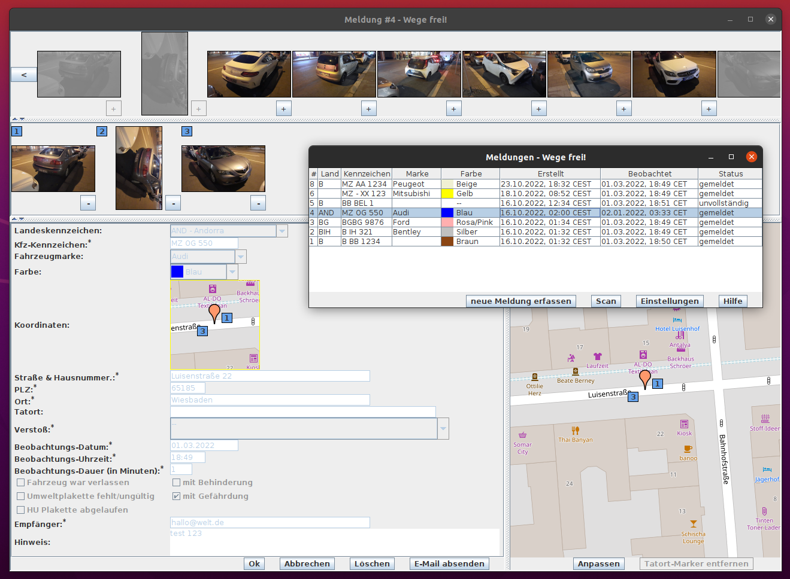
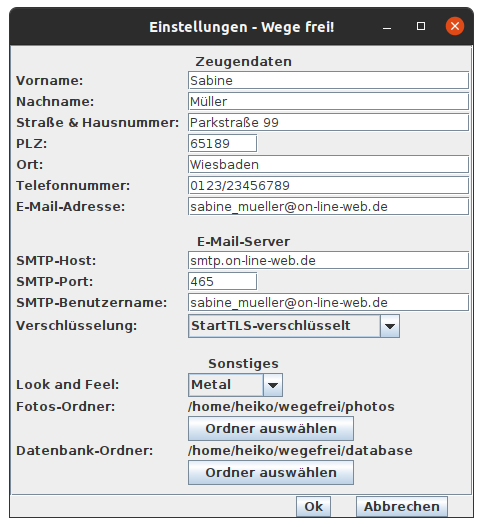

# Wege frei! PC

Wege-frei! PC ist ein Programm für den PC/Mac/Raspberry Pi/Desktop/Laptop, um Falschparker_innen zu melden. Die Idee zu diesem Projekt basiert auf der Wegeheld-App und der Weg.li-Website.

## Besonderheit

Alle Daten (Beweisfotos und Meldungen) werden auf dem eigenen PC gespeichert. Der Versand erfolgt über das persönliche E-Mail-Postfach direkt an das zuständige Ordnungsamt. Hierdurch ergibt sich ein Geschwindigkeitsvorteil und im Sinne der Datensparsamkeit werden die Daten nicht durch zusätzliche Dienstleister verarbeitet. Das Layout und Look & Feel ist flexibel an die Bedürfnisse der Anwender_in anpassbar.

## Typischer Ablauf

 1. Falsch parkende Fahrzeuge fotografieren. Es können mehrere Fotos mit Kfz-Kennzeichen, Verkehrszeichen, HU- & Umwelt-Plakette, Anfang und Ende der Beoabachtung, etc... gemacht werden.
 1. Fotos (z.B. via USB-Kabel) vom Smartphone in einen Ordner auf den PC kopieren.
 1. Meldungen erfassen. Einige Daten wie Tat-Datum, -Uhrzeit, -Dauer und Adresse werden automatisch im Formular eingetragen. Kontrolle der Fotos durch integrierten Bildbetrachter und Adresse des Tatorts durch integrierte Kartenanzeige.
 1. Meldungen über integrierten E-mail-Client über das eigene E-Mail-Postfach an das zuständige Ordnungsamt senden.
 
## Downloads

 * Windows/x86-64: [WegeFrei-1.0.2.msi](https://www.heikozelt.de/wegefrei/download/WegeFrei-1.0.2.msi)
 * Ubuntu-Linux/x86-64: [wegefrei_1.0.2-1_amd64.deb](https://www.heikozelt.de/wegefrei/download/wegefrei_1.0.2-1_amd64.deb)
 * Apple MacOS/x86-64, [WegeFrei-1.0.2.dmg](https://www.heikozelt.de/wegefrei/download/WegeFrei-1.0.2.dmg)
 * Betriebssystem- & Prozessor-unabhängig. Es wird zusätzlich Java 17 benötigt. Start mit `java -jar wegefrei-1.0.2.jar` 
   [wegefrei-1.0.2.jar](https://www.heikozelt.de/wegefrei/download/wegefrei-1.0.2.jar)
   
Smartphones und Tablets (Android, iOS & iPadOS) werden nicht unterstützt.
 
## Installation

Am einfachsten ist die Verwendung eines Software-Paketes, abhängig vom Betriebssystem und Prozessor/CPU-Familie.
Sollte es (noch) kein Paket für Deine Plattform (Betriebssystem & CPU) geben, schreibe mich bitte an oder verwende die plattformunabhängige .jar-Datei.
Zur Ausführung der .jar-Datei, welche Java Byte Code enthält wird zusätzlich eine Java Virtual Machine ab Version 17 benötigt.

## Deinstallation

Die Software kann über den Betriebssystem-spezifischen Paket-Manager wieder deinstalliert werden.
Die Konfigurationsdatei `.wege_frei_v1.settings.json` und die Datenbankdateien `wege_frei_v1.mv.db` & `wege_frei_v1.trace.db`,
welche standardmäßig im Benutzer-Home-Verzeichnis liegen, müssen manuell gelöscht werden.

## Konfiguration

Nach der Installation kannst du direkt Meldungen erfassen. Wenn du die Beweiss-Fotos von deinen Urlaubsfotos, etc... trennen möchtest, kannst du unter Einstellungen einen anderen Ordner angeben. Bevor Du Meldungen an das Ordnungsamt übertragen kannst, musst du deine Zeugen-Daten angeben. Annonyme Anzeigen werden nicht akzeptiert. Außerdem werden die Konfigurations-Daten eines Postausgangs-Servers (SMTP) benötigt.

## Empfehlungen

 * Fotos verschlüsselt speichern (z.B. mit VeraCrypt)
 * Beim E-Mail-Versand TLS-Verschlüsselung verwenden
 
## Datenschutz

Die Software verwendet Web-Services/APIs. Bei der Benutzung wird deine IP-Adresse daher an folgende Websites übermittelt:
 * https://tile.openstreetmap.org/ für die Kartendartstellung (Download von Kachel-Bildern)
 * https://nominatim.openstreetmap.org/ für die Suche nach Post-Anschrifts-Adressen von Tatort-Geo-Koordinaten

Bei Nutzung des Internets wird deine IP-Adresse natürlich auch an den Internet-Zugangs-Provider übermittelt und beim Versand von E-Mails an den E-Mail-Provider.
